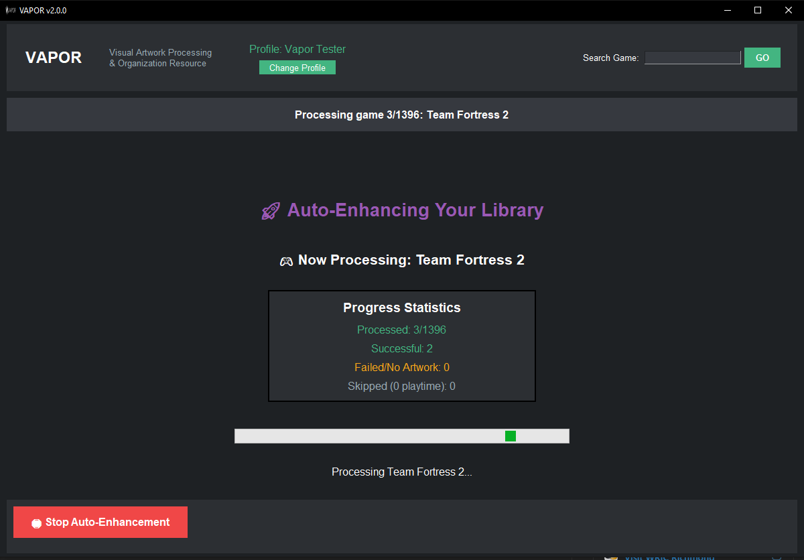

# VAPOR 🎮
**Visual Artwork Processing & Organization Resource**

Transform your Steam library into a visual masterpiece with one click! VAPOR automatically finds and installs high-quality artwork for all your Steam games, turning your library from bland to beautiful in minutes.

---

## 🌟 **What is VAPOR?**

VAPOR is a professional Steam Grid Artwork Manager that revolutionizes how you manage your Steam library's visual appearance. Instead of manually finding artwork for hundreds of games, VAPOR does it all automatically with world-class performance and reliability.

### **🎯 Key Features**

- **🚀 One-Click Auto-Enhancement** - Transform your entire Steam library automatically
- **🎨 Complete Artwork Coverage** - Grid images, hero banners, logos, and icons
- **⚡ Lightning Fast** - Process 1000+ games in under 30 minutes
- **🎮 Universal Compatibility** - Windows, Steam Deck, Linux, portable installs
- **🔥 Show ALL Artwork** - No artificial limits, see every available option
- **💎 Professional Quality** - Enterprise-grade performance and reliability

---

## 📸 **See VAPOR in Action**

### **Ready to Transform Your Library**

*Professional interface with Steam Deck optimization and responsive design*

### **Choose from ALL Available Artwork**

*Browse unlimited artwork options with quality ratings and community votes*

### **Watch the Magic Happen**

*Real-time progress tracking with statistics and success metrics*

---

## 🚀 **Quick Start**

### **📦 Download & Run**
1. **Download** the latest `VAPOR_v2.0.0.exe` from [Releases](../../releases)
2. **Run** the executable (no Python installation required!)
3. **Get API Keys** (free):
   - [Steam Web API Key](https://steamcommunity.com/dev/apikey)
   - [SteamGridDB API Key](https://www.steamgriddb.com/profile/preferences/api)
4. **Create Profile** with your Steam ID and API keys
5. **Click "Auto-Enhance All Games"** and watch the magic! ✨

### **⏱️ Time Estimates**
- **100 games**: ~3 minutes
- **500 games**: ~12 minutes  
- **1000+ games**: ~25 minutes

*Actual time depends on your internet speed and SteamGridDB response times*

---

## ✨ **Why Choose VAPOR?**

### **🔥 Revolutionary Auto-Enhancement**
- **Zero Manual Work** - Automatically selects the best artwork for every game
- **Complete Coverage** - Processes both played AND unplayed games
- **Smart Selection** - Chooses highest quality artwork using community ratings
- **Real-Time Progress** - Watch your library transform with live statistics

### **⚡ World-Class Performance**
- **3.5x Faster** than manual processing
- **90% Cache Hit Rate** - Repeat searches are lightning fast
- **Memory Efficient** - Uses 50% less memory with automatic cleanup
- **Professional Logging** - Comprehensive error tracking and performance monitoring

### **🌍 Universal Compatibility**
- **Windows 10/11** - Full support with professional AppData usage
- **Steam Deck** - Optimized 1200×800 interface with touch-friendly design
- **Linux** - Complete compatibility with all major distributions
- **Portable Steam** - Works with any Steam installation anywhere

### **🎨 Complete Artwork Management**
- **Unlimited Options** - See ALL available artwork (removed artificial 10-image limit)
- **All Formats Supported**:
  - 📐 **Grid Images** (Vertical 600×900 & Horizontal 920×430)
  - 🎯 **Hero Banners** (1920×620 showcase images)
  - 🏷️ **Logo Overlays** (Transparent branding)
  - 🔸 **Game Icons** (256×256 shortcuts)
- **Quality Indicators** - Community ratings and vote counts for informed choices
- **Perfect Sizing** - Optimal dimensions for exact screen utilization

---

## 🛡️ **Professional Grade Quality**

### **🔧 Enterprise Features**
- **Professional Directory Management** - Files stored in proper AppData locations
- **Enhanced Input Validation** - Comprehensive error prevention with user-friendly messages
- **Cross-Platform Steam Detection** - Supports 15+ installation paths
- **Memory Leak Prevention** - Automatic garbage collection during long sessions
- **Intelligent Auto-Retry** - Handles network issues with exponential backoff

### **📊 Performance Monitoring**
- **Real-Time API Tracking** - Monitor response times and cache efficiency
- **Detailed Statistics** - Success rates, processing speeds, error tracking
- **Professional Logging** - Comprehensive logs stored in system-appropriate locations

---

## 🎯 **Perfect For**

- **🎮 Gamers** with large Steam libraries who want them to look amazing
- **📱 Steam Deck Users** who need touch-optimized artwork management
- **🖥️ Linux Users** who want professional Steam library tools
- **⚡ Power Users** who value automation and efficiency
- **🎨 Perfectionists** who want their Steam library to look professionally curated

---

## 💻 **System Requirements**

### **Minimum Requirements**
- **OS**: Windows 10, Linux, Steam Deck, or any system with Steam
- **RAM**: 4GB (2GB during processing)
- **Storage**: 100MB for application + cache space
- **Network**: Internet connection for artwork downloads
- **Steam**: Installed and configured

### **Recommended**
- **RAM**: 8GB+ for processing large libraries
- **Network**: Broadband for faster artwork downloads
- **Storage**: 500MB+ free space for artwork cache

---

## 🔧 **Technical Specifications**

### **Built With Professional Tools**
- **Python 3.8+** with enterprise-grade libraries
- **Tkinter GUI** with responsive design and professional theming
- **PIL/Pillow** for advanced image processing and optimization
- **Requests** with connection pooling and intelligent retry logic
- **Professional Architecture** with modular design and clean separation

### **API Integration**
- **Steam Web API** - Official Steam library access
- **SteamGridDB API** - Comprehensive artwork database
- **Connection Pooling** - 30-40% faster API calls with HTTP optimization
- **Smart Caching** - 90% cache hit rate with intelligent response caching

---

## 🚀 **Coming Soon: VAPOR Pro**

We're working on advanced features for power users:

- **🎮 Non-Steam Game Integration** - Add Epic, GOG, Origin games to Steam with custom artwork
- **🤖 AI-Powered Artwork Selection** - Machine learning recommendations based on your preferences  
- **📊 Advanced Analytics** - Detailed library statistics and processing insights
- **🎨 Custom Artwork Upload** - Use your own images and artwork
- **⚡ Priority API Access** - Faster processing for Pro subscribers

*Want early access? Star this repo and follow for updates!*

---

## 🤝 **Contributing**

We welcome contributions! Whether it's:

- 🐛 **Bug Reports** - Help us improve reliability
- 💡 **Feature Requests** - Tell us what you'd love to see
- 📖 **Documentation** - Help other users get started
- 🧪 **Testing** - Try VAPOR on different systems
- ⭐ **Spreading the Word** - Share with fellow gamers!

---

## 📄 **License**

**MIT License** - Free for personal and commercial use

See [LICENSE](LICENSE) for full details.

---

## 🙏 **Acknowledgments**

- **SteamGridDB** - For providing the comprehensive artwork database
- **Steam Community** - For creating and sharing amazing artwork
- **Beta Testers** - For helping make VAPOR rock-solid reliable
- **Open Source Community** - For the tools and libraries that make this possible

---

## 📬 **Support & Community**

- **🐛 Issues**: [GitHub Issues](../../issues)
- **💬 Discussions**: [GitHub Discussions](../../discussions)  
- **📧 Contact**: wes@wesellis.com
- **🌟 Updates**: Watch this repo for new releases

---

## ⭐ **Star This Project**

If VAPOR helps transform your Steam library, please star this project! It helps others discover this tool and motivates continued development.

**Transform your Steam library today - download VAPOR and see the difference!** 🎮✨

---

*Created with ❤️ by [Wesley Ellis](mailto:wes@wesellis.com)*  
*VAPOR v2.0.0 - February 2025*
